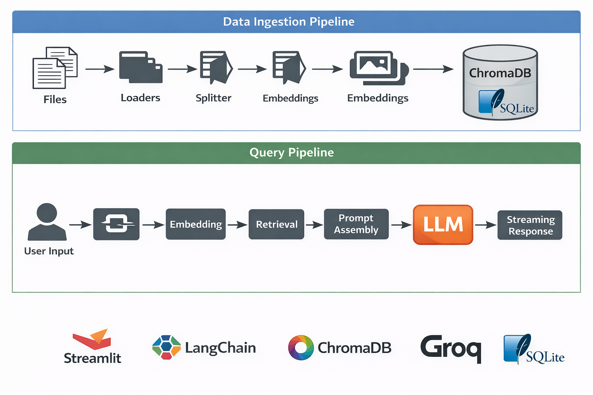
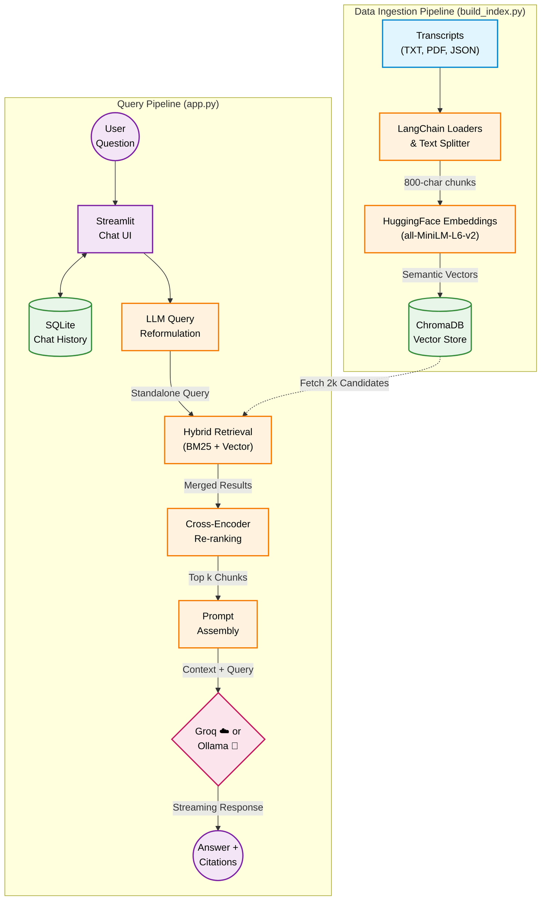

# 📈 Trading RAG Mentor

> **Personal AI Trading Mentor** — A custom Retrieval-Augmented Generation (RAG) system built on momentum & price action video transcripts. Ask questions and get answers grounded exclusively in your own trading knowledge base.

---

## 📌 Table of Contents

- [Overview](#overview)
- [Features](#features)
- [Prerequisites](#prerequisites)
- [Setup Instructions](#setup-instructions)
- [Running the App](#running-the-app)
- [Using the App](#using-the-app)
- [Sidebar Configuration](#sidebar-configuration)
  - [LLM Provider Toggle](#llm-provider-toggle)
  - [Ollama (Local & Private)](#ollama-local--private)
- [Session Management](#session-management)
- [Source Citations & Relevance Scores](#source-citations--relevance-scores)
- [Running Evaluation Tests](#running-evaluation-tests)
- [RAG Evaluation Framework](#rag-evaluation-framework)
- [Adding Your Own Transcripts](#adding-your-own-transcripts)
- [🐳 Docker & Deployment](#-docker--deployment)
  - [Local Docker (docker compose)](#local-docker-docker-compose)
  - [Deploy to Render.com](#deploy-to-rendercom)
  - [Deploy to Railway.app](#deploy-to-railwayapp)
- [Project Structure](#project-structure)
- [How It Works](#how-it-works)
- [Troubleshooting](#troubleshooting)

---

## Overview

This project is a **personal AI coach** that answers trading questions strictly using your own video transcripts. It uses:

- **LangChain** for RAG pipeline orchestration
- **ChromaDB** as the local vector database
- **HuggingFace Embeddings** (`all-MiniLM-L6-v2`) for semantic search — runs locally, no API key needed
- **Groq LLM** (cloud, fast inference) or **Ollama** (local, fully private) — switchable live in the sidebar
- **SQLite** for persistent multi-session chat history
- **Streamlit** for the interactive web UI with live sidebar controls

The AI will **only** answer from your transcripts. If the answer isn't in your notes, it replies: _"Not in my notes."_

---

## Features

| Feature                           | Details                                                                            |
| --------------------------------- | ---------------------------------------------------------------------------------- |
| 🔍 **RAG pipeline**               | Semantic search over your transcripts using ChromaDB + HuggingFace embeddings      |
| 🗂️ **Multi-session chat history** | Conversations persist across browser refreshes in SQLite                           |
| ⚙️ **Live sidebar configuration** | Switch model, adjust temperature and retrieval count (`k`) without restarting      |
| 📄 **Source citations**           | Every answer shows which transcripts were retrieved                                |
| 🟢 **Relevance score badges**     | Each source shows a colour-coded match % (green / yellow / red)                    |
| 🧪 **Evaluation test suite**      | 18 pytest tests covering index integrity, retrieval quality, and prompt validation |
| 🧠 **Conversational memory**      | Follow-up questions auto-reformulated into standalone queries using chat context   |
| 🔀 **Hybrid search**              | BM25 keyword matching + vector similarity via EnsembleRetriever for better recall  |
| 📊 **Cross-encoder re-ranking**   | Re-ranks retrieved chunks with `ms-marco-MiniLM-L-6-v2` for higher precision       |
| 📁 **Multi-format ingestion**     | Supports `.txt`, `.pdf`, and `.json` transcript files                              |
| 🦙 **Ollama support**             | Run any local model (Llama, Gemma, Mistral, Qwen…) with zero data leaving your machine |

---

## 🏛️ Architecture & How It Works





- **Chunk size:** 800 characters with 100-character overlap (see `docs/chunking_strategy.md`)
- **Retrieval:** Multi-stage hybrid search + cross-encoder re-ranking (see `docs/retrieval_strategy.md`)
- **Embedding model:** `all-MiniLM-L6-v2` (runs locally, ~90 MB, cached after first run)
- **Conversational Memory:** SQLite persists sessions, LLM reformulates follow-up queries

---

## Prerequisites

Ensure the following are installed on your system before proceeding:

| Requirement         | Version | Notes                                                           |
| ------------------- | ------- | --------------------------------------------------------------- |
| **Python**          | 3.9+    | [Download](https://www.python.org/downloads/)                   |
| **pip**             | Latest  | Comes with Python                                               |
| **`jq`** (CLI tool) | Any     | Required for JSON document loading — `brew install jq` on macOS |
| **Groq API Key**    | —       | Free at [console.groq.com](https://console.groq.com) *(only needed for Groq provider)* |
| **Ollama**          | Latest  | [ollama.com](https://ollama.com) — only needed for local inference |

> **Note:** An internet connection is required on first run to download the HuggingFace embedding model (`~90 MB`). After that, it works fully offline for embeddings. With Ollama, **inference is also fully offline**.

---

## Setup Instructions

### 1. Clone the Repository

```bash
git clone https://github.com/sudhakarbadugu/trading-rag-mentor.git
cd trading-rag-mentor
```

### 2. Create a Virtual Environment

```bash
python3 -m venv venv
```

### 3. Activate the Virtual Environment

- **macOS / Linux:**
  ```bash
  source venv/bin/activate
  ```
- **Windows:**
  ```bash
  venv\Scripts\activate
  ```

You should see `(venv)` appear in your terminal prompt.

### 4. Install Dependencies

```bash
pip install -r requirements.txt
```

### 5. Set Up Your Environment Variables

Create a `.env` file in the project root:

```bash
touch .env
```

Add the following to `.env`:

```env
# ── Groq (cloud) ──────────────────────────────────────────────
GROQ_API_KEY=your_groq_api_key_here
GROQ_MODEL_NAME=openai/gpt-oss-120b

# ── Ollama (local) — optional, only needed if using Ollama ────
# LLM_PROVIDER=Ollama (Local & Private)
# OLLAMA_BASE_URL=http://localhost:11434
# OLLAMA_MODEL=gemma3:1b
```

| Variable           | Required          | Description                                                                      |
| ------------------ | ----------------- | -------------------------------------------------------------------------------- |
| `GROQ_API_KEY`     | ✅ For Groq       | Your Groq API key — get one free at [console.groq.com](https://console.groq.com) |
| `GROQ_MODEL_NAME`  | Optional          | Default Groq model shown in the sidebar                                          |
| `LLM_PROVIDER`     | Optional          | Pre-select provider on launch: `Groq (Fast Cloud)` or `Ollama (Local & Private)` |
| `OLLAMA_BASE_URL`  | Optional          | Ollama server URL — default `http://localhost:11434`                             |
| `OLLAMA_MODEL`     | Optional          | Default Ollama model tag — default `gemma3:1b`                                   |

> **Security:** `.env` is listed in `.gitignore` and will never be committed. Never share this file.

### 6. Add Your Transcripts

Place your trading video transcripts in the `data/transcripts/` folder. Supported file formats:

| Format  | Notes                                         |
| ------- | --------------------------------------------- |
| `.txt`  | Plain text transcripts                        |
| `.pdf`  | PDF documents                                 |
| `.json` | JSON files (any structure — parsed with `jq`) |

> The index is built **automatically on first run**. If `data/chroma_db/` already exists and is non-empty, the index step is skipped.

---

## Running the App

Make sure your virtual environment is active, then run:

```bash
streamlit run src/app.py
```

Open **[http://localhost:8501](http://localhost:8501)** in your browser.

---

## Using the App

1. Type your trading question in the **chat input box** at the bottom of the page.
2. Press **Enter** — the assistant searches your transcripts and responds with a structured answer:
   - **Direct Answer** — the core actionable takeaway
   - **Key Reasoning** — momentum or price action logic from your notes
   - **Risk Management** — stops, position sizing, capital preservation tips
   - **Learning Notes** — 3–5 bullet reinforcements
   - **Action Steps** — what to watch for on the chart
3. Below the answer, expand **📄 Sources** to see which transcripts were retrieved and how well they matched.

> If the question isn't covered in your transcripts, the response will be: **"Not in my notes."**

---

## Sidebar Configuration

The **⚙️ RAG Configuration** sidebar lets you tune the pipeline live without restarting:

### LLM Provider Toggle

At the top of the sidebar, a **🤖 LLM Provider** radio button lets you switch between:

| Option | Description |
|---|---|
| **Groq (Fast Cloud)** | Calls the Groq API — fastest inference, requires `GROQ_API_KEY` |
| **Ollama (Local & Private)** | Runs a model on your machine — no data leaves your network |

A **connection status badge** appears below the toggle — 🟢 Connected or 🔴 Not running. If Ollama is unreachable, an **⚡ Switch to Groq** button appears so you can fall back instantly.

### Ollama (Local & Private)

When Ollama is selected, two additional controls appear:

| Control | Default | Description |
|---|---|---|
| **Ollama Model** | `gemma3:1b` | Selectbox of your locally installed models |
| **Ollama Base URL** | `http://localhost:11434` | URL of your Ollama server — change for remote/Docker Ollama |

**Quick Ollama setup:**
```bash
# Install Ollama
brew install ollama       # macOS
# or download from https://ollama.com

# Start the server
ollama serve

# Pull a model (pick any that fits your RAM)
ollama pull gemma3:1b     # 815 MB — fastest
ollama pull gemma3:latest # 3.3 GB — better quality
ollama pull mistral       # 4.1 GB
```

Then open the sidebar, select **Ollama (Local & Private)**, and pick your model.

### Other Controls

| Control            | What it does                                                                                      |
| ------------------ | ------------------------------------------------------------------------------------------------- |
| **🧩 Model**       | Switch between available Groq or Ollama models without restarting                                 |
| **🌡️ Temperature** | `0.0` = deterministic answers, `1.0` = more creative — default is `0.0` for strict factual recall |
| **🔍 k (chunks)**  | Number of transcript chunks retrieved per query (1–15, default 6) — increase for broader context  |

Changes apply to the **next** question you ask.

---

## Session Management

Chat history is **persisted in SQLite** (`data/chat_history.db`) and survives browser refreshes and app restarts.

| Action                      | How                                     |
| --------------------------- | --------------------------------------- |
| **Start a new session**     | Click **➕ New Session** in the sidebar |
| **Switch between sessions** | Use the **Switch session** dropdown     |
| **Clear a session**         | Click **🗑️ Clear This Session**         |

Each session is stored independently and can be revisited at any time.

---

## Source Citations & Relevance Scores

After every answer, expand the **📄 Sources** panel to see:

- **Filename** of the retrieved transcript
- **Page number** (for PDFs)
- **Relevance badge** — colour-coded match score from ChromaDB cosine similarity:

| Badge | Score  | Meaning                              |
| ----- | ------ | ------------------------------------ |
| 🟢    | ≥ 70%  | Strong match — highly relevant chunk |
| 🟡    | 40–69% | Moderate match — partially relevant  |
| 🔴    | < 40%  | Weak match — treat with caution      |

- **Content preview** — first 300 characters of the retrieved chunk

---

## Running Evaluation Tests

The project includes a **pytest evaluation suite** that tests retrieval quality and pipeline integrity — no LLM calls needed (fast and free).

```bash
# Make sure venv is active
source venv/bin/activate

# Run all 18 tests
python -m pytest tests/ -v
```

### What the tests cover

| Test Class             | What it checks                                                                                                                                        |
| ---------------------- | ----------------------------------------------------------------------------------------------------------------------------------------------------- |
| `TestIndexIntegrity`   | `data/chroma_db/` exists & non-empty, data dir has transcript files, vectorstore loads correctly                                                      |
| `TestRetrievalQuality` | 5 known trading Q&A pairs — keyword assertions + minimum relevance score thresholds + sanity check (trading query scores higher than off-topic query) |
| `TestPromptTemplate`   | `{context}` and `{question}` placeholders exist, RAG grounding instructions are present                                                               |

All 18 tests should pass in ~15 seconds.

---

## RAG Evaluation Framework

Beyond basic retrieval tests, this project includes a **full RAG evaluation pipeline** that measures answer quality across three dimensions:

| Metric                  | What it measures                                      | Method                                    |
| ----------------------- | ----------------------------------------------------- | ----------------------------------------- |
| **Retrieval Recall**    | Are the right transcript chunks retrieved?            | Keyword matching against expected context |
| **Answer Faithfulness** | Is the answer grounded in context (no hallucination)? | LLM-as-judge via Groq                     |
| **Answer Relevance**    | Does the answer address the question?                 | LLM-as-judge via Groq                     |

### Golden QA Dataset

`tests/golden_qa.json` contains 12 curated question/keyword triplets spanning VCP patterns, risk management, entry rules, fundamentals, and mindset — all grounded in actual transcript content.

### Running the evaluation

```bash
# Retrieval recall only (fast, no API key needed)
python scripts/evaluate_rag.py --retrieval-only

# Full evaluation with LLM-as-judge (requires GROQ_API_KEY)
python scripts/evaluate_rag.py
```

Results are saved to `scripts/evaluation_results.json` and printed as a table:

```
ID                             Category           Retrieval   Faith.    Relev.
--------------------------------------------------------------------------------
vcp_definition                 vcp                100%        1.0       1.0
200_day_ma_rule                entries             83%        1.0       1.0
stop_loss_rule                 risk_management    100%        1.0       1.0
...
--------------------------------------------------------------------------------
MEAN                                               87%        0.95      0.97
```

### Design decisions

- **LLM-as-judge** rather than embedding similarity — catches semantic hallucination, not just keyword overlap.
- **No new dependencies** — built entirely on the existing LangChain + Groq stack.
- **Pytest integration** — `tests/test_rag_evaluation.py` validates the dataset and retrieval recall without LLM calls.
- See [`docs/evaluation_framework.md`](docs/evaluation_framework.md) for the full methodology.

> 💡 **Industry context:** This approach follows the same evaluation dimensions as [RAGAS](https://docs.ragas.io/) and [DeepEval](https://docs.deepeval.com/), the two leading RAG evaluation frameworks.

---

## Adding Your Own Transcripts

1. Drop files into `data/transcripts/`
2. Supported formats: `.txt`, `.pdf`, `.json`
3. Delete `data/chroma_db/` to force a re-index:
   ```bash
   rm -rf data/chroma_db/
   ```
4. Re-run the app — the index rebuilds automatically on startup

---

## 🐳 Docker & Deployment

The project ships with a **multi-stage Dockerfile**, a **docker-compose.yml** for local dev, and platform configs for **Render.com** and **Railway.app**. All three share the same image with zero changes — `$PORT` is injected by the platform at runtime.

### Local Docker (docker compose)

```bash
# 1. Copy the example env file and add your Groq API key
cp .env.example .env          # then set GROQ_API_KEY=<your_key>

# 2. Build and start (first build takes ~10 min — torch is large)
docker compose up

# 3. Open the app
open http://localhost:8501

# ── Common commands ───────────────────────────────────────────
docker compose up --build     # force rebuild after code changes
docker compose down           # stop (volumes preserved)
docker compose down -v        # stop + wipe all persistent data
```

> **Volumes:** ChromaDB and `chat_history.db` are stored in the `trading_rag_data` named volume and survive restarts. Your transcripts are bind-mounted read-only from `./data/transcripts/` — drop new files there and the next query triggers an incremental re-index automatically.

### Deploy to Render.com

1. Push this repo to GitHub.
2. In the Render dashboard → **New → Blueprint** → connect your repo.
3. Render detects `render.yaml` and provisions the web service + a **5 GB persistent disk** mounted at `/app/data`.
4. Set `GROQ_API_KEY` in **Environment → Secret Files** (never hardcode it).
5. Every push to `main` triggers an auto-deploy.

| Setting | Value |
|---|---|
| Instance | `starter` ($7/mo) — upgrade to `standard` for production |
| Port | `10000` (injected as `$PORT` automatically) |
| Persistent disk | `/app/data` — 5 GB (covers ChromaDB + chat history) |
| Health check | `/_stcore/health` |

### Deploy to Railway.app

1. Push this repo to GitHub.
2. In Railway → **New Project → Deploy from GitHub repo** → select this repo.
3. Railway detects `railway.json`, builds the Dockerfile, and injects `$PORT`.
4. Add `GROQ_API_KEY` in the **Variables** tab.
5. Add a **Volume** in Railway and mount it at `/app/data` to persist ChromaDB across deploys.

| Setting | Value |
|---|---|
| Builder | Dockerfile |
| Port | Injected automatically as `$PORT` |
| Health check | `/_stcore/health` (120 s timeout) |
| Restart policy | On failure, max 3 retries |

---

## Project Structure

```
trading-rag-mentor/
├── data/
│   ├── chat_history.db     # SQLite chat history (gitignored)
│   ├── chroma_db/          # Auto-generated vector database (gitignored)
│   └── transcripts/        # Your trading video transcripts (.txt, .pdf, .json)
├── src/
│   ├── __init__.py         # Package root
│   ├── app.py              # Streamlit chat UI + RAG pipeline + sidebar config
│   ├── build_index.py      # Document loading, chunking & ChromaDB indexing
│   ├── chat_history.py     # SQLite persistence for multi-session chat history
│   ├── prompts.py          # System prompt + reformulation prompt
│   └── retrieval.py        # Hybrid search (BM25+vector) + cross-encoder re-ranking
├── tests/
│   ├── test_rag_pipeline.py     # pytest evaluation suite (18 tests)
│   ├── test_rag_evaluation.py   # RAG evaluation tests (retrieval recall)
│   └── golden_qa.json           # Golden QA dataset (12 Q/A triplets)
├── scripts/
│   └── evaluate_rag.py          # Full RAG evaluation script (3 metrics)
├── docs/
│   ├── chunking_strategy.md     # Chunking approach justification
│   ├── evaluation_framework.md  # Evaluation methodology documentation
│   └── retrieval_strategy.md    # Hybrid search + re-ranking rationale
├── Dockerfile              # Multi-stage production image (python:3.12-slim)
├── .dockerignore           # Excludes secrets, caches, and volumes from build
├── docker-compose.yml      # Local dev stack with persistent volumes
├── render.yaml             # Render.com Blueprint IaC (web service + disk)
├── railway.json            # Railway.app deployment config
├── .env                    # Your API keys (gitignored — never committed)
├── .env.example            # Template for required environment variables
├── requirements.txt        # Python dependencies
└── README.md
```

## Troubleshooting

| Problem                               | Solution                                                     |
| ------------------------------------- | ------------------------------------------------------------ |
| `GROQ_API_KEY not set` error          | Ensure `.env` exists in the project root with your key       |
| `No documents found to index`         | Make sure files exist in `data/transcripts/`                 |
| Old answers after adding transcripts  | Delete `data/chroma_db/` and restart the app                 |
| `jq` not found                        | `brew install jq` (macOS) or `apt install jq` (Linux)        |
| Embeddings download is slow           | First-run only; cached in `~/.cache/huggingface/` after that |
| Port 8501 already in use              | Run `streamlit run src/app.py --server.port 8502`            |
| Tests fail with `chroma_db not built` | Run the app once first to build the index, then run tests    |
| Ollama — 🔴 Not running badge         | Run `ollama serve` in a separate terminal                    |
| Ollama — model not found error        | Run `ollama pull <model-name>` to download the model first   |
| Ollama — slow first response          | Model is loading into RAM; subsequent queries are faster     |
| Ollama — out of memory                | Use a smaller model (e.g. `gemma3:1b`) or increase RAM       |
| Docker build fails on spaCy model     | Ensure internet access during `docker build` (model download) |
| Container OOM killed                  | Increase memory limit in `docker-compose.yml` (`deploy.resources.limits.memory`) |
| Render deploy stuck at health check   | Check logs — index build on first start can take 2–3 minutes |
| Railway volume not persisting         | Attach a Volume in Railway dashboard and mount at `/app/data` |

---

## License

MIT License — see [LICENSE](./LICENSE) for details.
